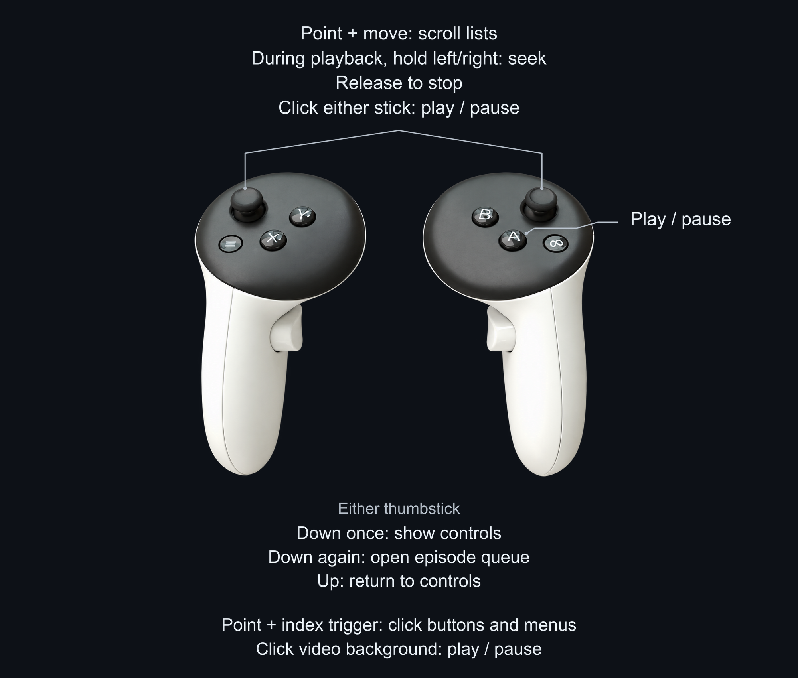

# Plex Quest patch



Patch your own Plex Android APK for TV-style browsing and Quest controller input.
Tested on Quest 3. No Plex APK is provided here.

**Supported input:** Plex **2026.17.0** (version code **971050399**, Play build).
Use a universal `.apk` or a complete `.apkm` / `.xapk` containing ARM64 libraries.
A split `base.apk` alone is incomplete.

## Patch your own APK

1. **Fork this repository** using the **Fork** button. You need your own fork to run the GitHub Action.
2. In **your fork**, open **Actions** and enable workflows if prompted.
3. Add the [signing secrets](#signing) to your fork. This is a one-time setup.
4. Open **Actions → Patch Plex APK → Run workflow**. Paste a **direct download URL**
   to your APK/APKM/XAPK file (not a download page), leave **signing enabled**, and run it.
5. When the run finishes, download the **`plex-quest-signed-…`** artifact under **Artifacts** and unzip it.
6. Sideload **`plex-quest-tv-aligned-signed.apk`** onto your Quest. With ADB:

   ```bash
   adb install -r plex-quest-tv-aligned-signed.apk
   ```

The result is **one signed, standalone APK**. It uses `com.plexapp.android.tv`,
with its own login/settings, and can coexist with the official Plex app.

## Signing

<details>
<summary>One-time signing setup</summary>

Android requires a signed APK. On a computer with a Java JDK installed, create
a signing key and choose a password when prompted:

```bash
keytool -genkeypair -keystore plex-quest.p12 -storetype PKCS12 \
  -alias plex-quest -keyalg RSA -keysize 4096 -validity 10000 \
  -dname "CN=Plex Quest"
```

Convert the key file to a single Base64 line:

```bash
base64 < plex-quest.p12 | tr -d '\n'
```

In **your fork**, go to **Settings → Secrets and variables → Actions → New repository secret**
and add:

| Secret | Value |
| --- | --- |
| `APK_KEYSTORE_BASE64` | The Base64 output above |
| `APK_KEY_ALIAS` | `plex-quest` |
| `APK_STORE_PASSWORD` | The password you chose |

If using an existing keystore with a different key password, also add `APK_KEY_PASSWORD`.
Keep your key file and password for future updates.

</details>

---

Unofficial; not affiliated with Plex. The [MIT license](LICENSE) covers this tooling,
not Plex or generated APKs.
